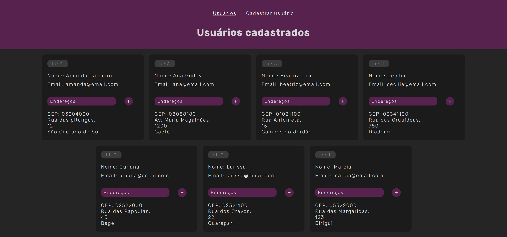

# :world_map: Gerenciador de Endereços

## :rocket: Tecnologias

Esse projeto foi desenvolvido com as seguintes tecnologias:

- HTML e CSS
- React.js
- Node.js
- Express.js
- Sequelize
- MySQL
- API

## :computer: Projeto

Gerenciador de Endereços permite o cadastro de contatos e seus endereços. Projeto usado para ministrar aulas do módulo de React.js no curso Full Stack Node.js da Digital House.